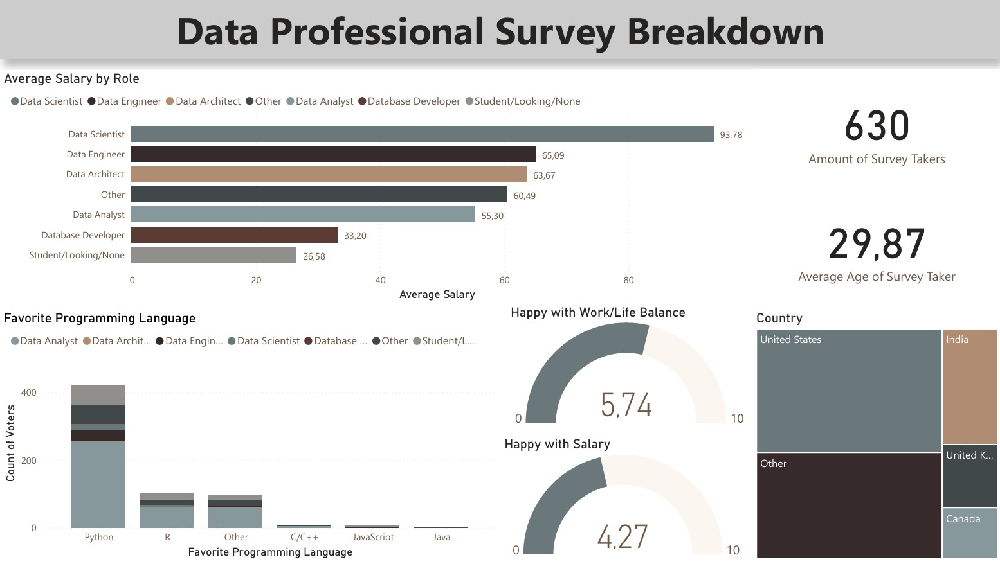

Kurssin suoritettuaan opiskelijalla on teoreettiset ja käytännön valmiudet käyttää Power BI:tä tehtävien analysointiin, esittämiseen ja automatisointiin omassa työnkulussaan.

Muodostaa yhteys tietolähteisiin käyttäen tuonti (import)-, DirectQuery- ja reaaliaikaisia (live connection) yhteysvaihtoehtoja.

Käyttää Power Query -editoria tiedon muuntamiseen ja puhdistamiseen.
Kirjoittaa M- ja R-skriptejä sekä hyödyntää datavirtoja (dataflows) tiedon muuntamiseen ja puhdistamiseen pilvessä.

Suunnitella tehokkaita raportteja käyttäen sisäänrakennettuja ja mukautettuja visualisointeja käyttäjäkokemuksen optimoimiseksi.

Toteuttaa rivi- ja saraketason tietoturvan raporteissa ja koontinäytöissä.
Julkaista Power BI Desktop -tiedostoja Power BI -raporttipalvelimeen (Power BI Report Server).

## Projekti

Kyselytutkimus Data-ammattilaisille

### Tiivistelmä

Tässä projektissa toteutettiin kattava analyysi data-alan ammattilaisille suunnatun kyselyn tuloksista. Projektin tavoitteena oli jalostaa raaka kyselydata informatiiviseksi ja visuaalisesti selkeäksi raportiksi, joka tarjoaa syvällisiä näkemyksiä alan ammattilaisten demografiasta, palkkatasoista, työtyytyväisyydestä ja teknologiavalinnoista.

Projektin Vaiheet

Datan keräys ja esikäsittely:

Projekti alkoi kyselydatan vastaanottamisella. Raakadata sisälti vastauksia 630 data-alan ammattilaiselta (perustuen esimerkkikuvaan).

Datanpuhdistus:

Suoritettiin huolellinen datanpuhdistusprosessi, joka sisälsi muun muassa puuttuvien arvojen käsittelyn, epäjohdonmukaisuuksien korjaamisen, datatyyppien validoinnin ja vastausten standardisoinnin analyysia varten. Tämä varmisti datan laadun ja luotettavuuden.

Analyysi:

Puhdistettua dataa analysoitiin tilastollisin menetelmin keskeisten trendien ja mallien tunnistamiseksi. Analyysi kattoi muun muassa palkkojen vertailun eri roolien välillä, suosituimpien ohjelmointikielten jakautumisen, työ- ja vapaa-ajan tasapainoon sekä palkkatyytyväisyyteen liittyvät arviot ja vastaajien maantieteellisen jakautumisen.

Visualisointi ja Raportointi:
Analyysin tulokset koottiin ja visualisoitiin interaktiiviseen raporttiin/dashboardiin. Visualisoinneissa hyödynnettiin selkeitä kaavioita, kuten palkki-, ympyrä- ja karttakaavioita sekä KPI-mittareita, jotta monimutkainen data olisi helposti ymmärrettävissä ja tulkittavissa yhdellä silmäyksellä.

Keskeiset Tulokset ja Hyödyt
Projekti tuotti arvokkaan, datalähtöisen raportin, joka tarjoaa kokonaiskuvan data-alan ammattilaisten profiilista ja työmarkkinatilanteesta. Raportti sisältää konkreettisia havaintoja esimerkiksi:

Keskimääräisistä palkoista eri rooleissa (Data Scientist, Data Engineer, Data Analyst jne.).
Suosituimmista ohjelmointikielistä (Python, R jne.).
Ammattilaisten tyytyväisyydestä palkkaan ja työelämän tasapainoon.
Vastaajien keski-iästä ja maantieteellisestä sijoittumisesta.
Tämä raportti toimii hyödyllisenä työkaluna esimerkiksi rekrytoinnin tukena, palkkavertailussa, koulutustarpeiden tunnistamisessa ja yleisesti alan trendien ymmärtämisessä.

